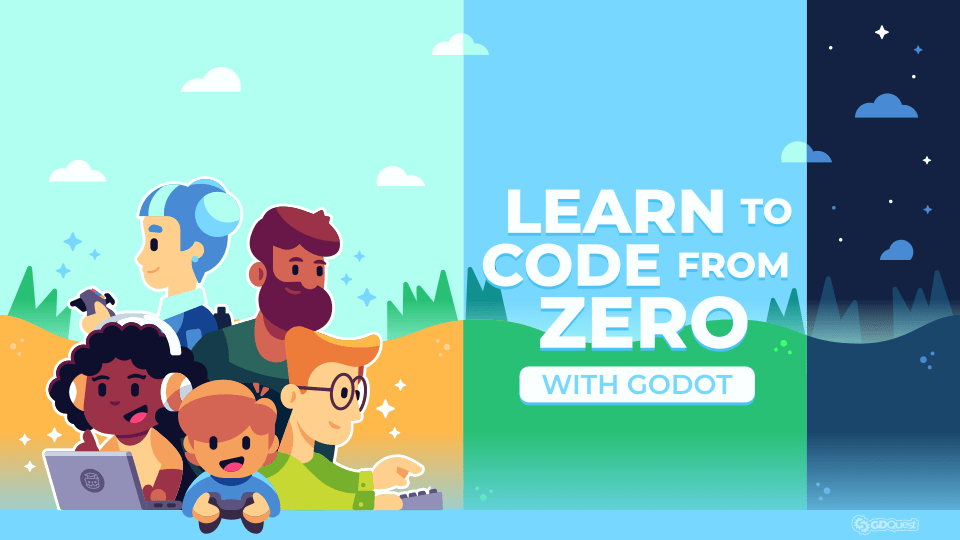

## Demo Lesson

# Image

Rewrite relative image paths into the absolute url format.
Including the thumbnail in the fronmatter.

Html-style image path:

## Replace Include Shortcodes
Add the filename to a code block based on an include shortcode it contains

## Add icons in front of node names
For example, the line `extends Sprite` tells Godot to append your code to all the code the Godot developers wrote for the `Sprite` type. That's how you can access the `_process()` function or member variables like `position` and `rotation` from GDScript. Signals allow nodes to communicate and react to one another. They are messages that nodes emit when something occurs to them. For example, a `Timer` emits the `"timeout"` signal when it times out.

## Output the preprocessed markdown files to a different location
Copy the media associated with these markdown files ( images/ folder, for example)
You could simplify this: you could just copy the content/ folder of a course to its target
location and preprocess markdown in-place at the target location.

## Rewrite URLs?
And if not, you can ask a new question. We wrote a how-to guide: [How to ask questions](/out/00.introduction/learn-to-code-how-to-ask-questions).

We wrote a companion guide about productivity to help you organize yourself and motivate you to keep going: [How to stay productive and motivated](/out/00.introduction/05.how-to-stay-productive-and-motivated).